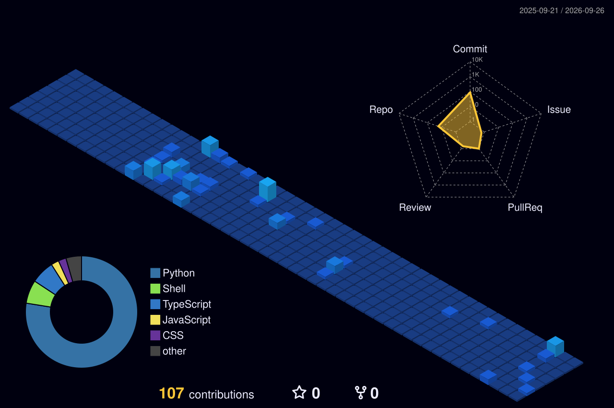

  <picture>
    <source media="(prefers-color-scheme: dark)" srcset="ascii.svg">
    <source media="(prefers-color-scheme: light)" srcset="ascii.svg">
    
  </picture>

  <h1>Hi there! 👋 I'm Suham Iqbal Khan</h1>
  <h3>Computer Science Student | Software Engineer</h3>

  

 

  <picture>
    <source media="(prefers-color-scheme: dark)" srcset="stats.svg">
    <source media="(prefers-color-scheme: light)" srcset="stats.svg">
    
  </picture>

 

  

<h2 id="about-me">👨‍💻 ABOUT ME</h2>

> **"I learn by shipping."** 🚀

Rather than relying solely on coursework, I focus on building complete systems from scratch across full-stack development, cloud infrastructure, mobile applications, and decentralized apps. 

- 🎓 **Education:** BS Computer Science @ Capital University of Science & Technology (Islamabad).
- 💼 **Experience:** Former MERN Stack Intern at IZOC Solutions. Contributed to real-world application features including JWT authentication, role-based access control, analytics dashboards, and complex REST API integrations.
- ☁️ **Currently Focused On:** Backend systems, serverless architecture, cloud technologies, applied AI/ML projects, and building distributed microservices.
- 🏅 **Achievements:** Final Year Project Competition Participant at NUML University Nexus Event (Project: UrbanEase - Convenience Meets Community).
- 📚 **Certifications:** Vibe Coding Fundamentals (University of Colorado), Reliability, Cloud Computing & Machine Learning (Johns Hopkins University).

<h2 id="latest-projects">⭐ LATEST PROJECTS</h2>

<table bordercolor="#30363d">
  <tr>
    <td width="50%" valign="top">
      <h3 align="center">☁️ <a href="https://github.com/Suham-Iqbal/cloudsync">Hybrid Cloud Sync Platform</a></h3>
      
A highly efficient Hybrid Real-Time Cloud Sync Platform that automatically synchronizes local files to cloud storage while providing live operational visibility. Features include Google Drive API integration, OAuth 2.0 authentication, MD5-based duplicate detection, round-robin workload distribution, retry mechanisms, and a live monitoring dashboard powered by Cloudflare Workers.

      
      
      
    </td>
    <td width="50%" valign="top">
      <h3 align="center">🔗 <a href="#">EtherDo (Web3)</a></h3>
      
EtherDo is a fully on-chain task management DApp that completely replaces traditional backend servers and databases with Ethereum smart contracts. It features immutable, verifiable, and transparent tasks stored via Solidity smart contracts on a Ganache local blockchain. Includes core operations like toggle status and soft delete, paired with a sleek glassmorphism frontend using Web3.js.

      
      
      
    </td>
  </tr>
  <tr>
    <td width="50%" valign="top">
      <h3 align="center">🏢 <a href="#">UrbanEase</a></h3>
      
A comprehensive community management application conceptualized to bridge the gap between residents and administrators. It greatly improves transparency by digitizing complaint tracking, enabling secure online bill payments, hosting a digital notice board, and offering an SOS-style emergency alert system for critical situations.

      
      
      
    </td>
    <td width="50%" valign="top">
      <h3 align="center">🤖 <a href="https://github.com/Suham-Iqbal/dograh-main">Dograh</a></h3>
      
An advanced, open-source, and self-hostable platform engineered for building production-ready AI voice agents. The platform boasts a highly intuitive visual workflow builder that seamlessly connects large language models (LLMs), Text-to-Speech (TTS), and Speech-to-Text (STT) modules in a containerized environment.

      
      
      
    </td>
  </tr>
</table>

<h2 id="more-projects">🔥 MORE PROJECTS</h2>

<table bordercolor="#30363d">
  <tr>
    <td width="50%" valign="top">
      <h3 align="center">💼 <a href="https://github.com/Suham-Iqbal/job-ready">Job Ready (AI Prep)</a></h3>
      
An AI-powered career transition platform designed to support job seekers in navigating the competitive tech industry. It features smart resume parsing, automated skill gap analysis, and tailored interview preparation powered dynamically by the Google Gemini AI API and managed via a scalable Supabase backend.

      
      
      
    </td>
    <td width="50%" valign="top">
      <h3 align="center">⚙️ <a href="https://github.com/Suham-Iqbal/init-n">Init N / Omnia</a></h3>
      
A sophisticated orchestration of autonomous AI workflows leveraging n8n. This project focuses on building complex, node-based automation pipelines that intelligently route data between multiple third-party APIs, databases, and LLM providers, completely automating redundant operational tasks.

      
      
      
    </td>
  </tr>
</table>

<h2 id="highlights">🏆 EXPERTISE & HIGHLIGHTS</h2>

<table bordercolor="#30363d">
  <tr>
    <td width="25%" align="center" valign="top">
      <b>☁️ Cloud & Distributed Systems</b>  
      Proficient in designing scalable Serverless Architectures, implementing OAuth 2.0 security, utilizing Cloudflare Workers for edge computing, and mastering Docker containerization for robust microservices.
    </td>
    <td width="25%" align="center" valign="top">
      <b>🧠 AI & Machine Learning</b>  
      Experienced in LLM integration, prompt engineering, and building fully autonomous workflows (n8n). Adept at creating real-time Voice Agents and leveraging data science concepts for smart applications.
    </td>
    <td width="25%" align="center" valign="top">
      <b>🌐 Full-Stack & Mobile</b>  
      Specialized in the MERN Stack and Next.js for high-performance web applications, paired with React Native for delivering seamless, cross-platform mobile experiences with beautiful UI/UX.
    </td>
    <td width="25%" align="center" valign="top">
      <b>⛓️ Web3 & Blockchain</b>  
      Hands-on experience writing secure Smart Contracts on Ethereum, developing decentralized applications (DApps) using Solidity, Ganache, and handling complex blockchain state management with Web3.js.
    </td>
  </tr>
</table>

<h2 id="tech-stack">🛠️ TECH STACK</h2>

**Languages:**
 

**Frontend & Mobile:**
 

**Backend & APIs:**
 

**Cloud, Databases & Tools:**
 

<h2 id="github-stats">📊 GITHUB STATS</h2>

  <table bordercolor="#30363d">
    <tr>
      <td width="50%" align="center">
        
      </td>
      <td width="50%" align="center">
        
      </td>
    </tr>
  </table>
   
  

<h2 id="activity-graph">📈 ACTIVITY OVERVIEW & RADAR</h2>

  

<h2 id="contribution-graph">📈 3D CONTRIBUTION GRAPH</h2>

  

<h2 id="contribution-snake">🐍 CONTRIBUTION SNAKE</h2>

  <picture>
    <source media="(prefers-color-scheme: dark)" srcset="github-contribution-grid-snake-dark.svg">
    <source media="(prefers-color-scheme: light)" srcset="github-contribution-grid-snake.svg">
    
  </picture>

<h2 id="connect">💼 OPEN TO OPPORTUNITIES & CONNECT</h2>

  <h3>🚀 Actively looking for Software Engineering and Full-Stack roles!</h3>
  
If you're looking for a developer who learns by shipping, let's connect.

   
  
  

