[github.com/Suham-Iqbal](https://github.com/Suham-Iqbal) &nbsp;·&nbsp;
[linkedin](https://linkedin.com/in/your-profile) &nbsp;·&nbsp;
[email](mailto:your.email@example.com)

> Full-Stack Software Engineer & AI Developer 
> BS Computer Science (Batch 2026)

I'm Suham, a software engineer passionate about designing and building scalable, reliable, and impactful software solutions. I enjoy solving real-world problems, exploring new technologies, and continuously improving my skills by building projects across web, mobile, AI, and cloud development.

<samp>javascript &nbsp; typescript &nbsp; python &nbsp; c++ &nbsp; react &nbsp; next.js &nbsp; react native &nbsp; node.js &nbsp; express &nbsp; fastapi &nbsp; mongodb &nbsp; postgresql &nbsp; sqlite &nbsp; supabase &nbsp; docker &nbsp; git</samp>

**[Dograh](https://github.com/Suham-Iqbal)** &nbsp;·&nbsp; <samp>python, next.js, docker</samp> 
An open-source, self-hostable platform for building production AI voice agents. 
Features a visual workflow builder connecting LLMs, TTS, and STT modules.

**[Job Ready](https://github.com/Suham-Iqbal)** &nbsp;·&nbsp; <samp>next.js, react, supabase</samp> 
An AI-powered career transition platform with smart resume analysis and 
interview prep, utilizing Google Gemini.

**[CloudSync Agent](https://github.com/Suham-Iqbal)** &nbsp;·&nbsp; <samp>node.js, express, react</samp> 
A distributed workload synchronization agent and full-featured web dashboard 
for seamless file management.

**[Init N / Omnia](https://github.com/Suham-Iqbal)** &nbsp;·&nbsp; <samp>n8n, rest apis, ai</samp> 
Complex autonomous AI workflows using n8n. Node-based automation pipelines 
connecting multiple APIs and databases.

Every graphic here is generated, not embedded from anyone else's server. 
`ascii.svg` is a photo pushed through a character ramp by 
[`scripts/make_portrait.py`](scripts/make_portrait.py); the stat graphics and 
these section headings are drawn by [a scheduled action](.github/workflows/refresh.yml) 
straight from the GitHub GraphQL API, once a day, committing only what changed.

They animate with SMIL inside the SVG, because GitHub strips scripts from 
READMEs — and since nothing loads from a third party, nothing here can 
rate-limit or go dark. The headings are SVGs for the same reason: GitHub also 
strips CSS, so an image is the only way to put this page's own typeface on them.
